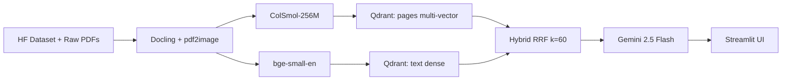

# Multi-Modal RAG QA System

A multi-modal Retrieval-Augmented Generation system for policy and financial documents. Uses vision-first retrieval via **ColSmol-256M** over page images, paired with a text channel via **BGE-small-en** (Sentence-Transformers) for lexical queries, fused with reciprocal rank fusion. Answer generation is powered by **Gemini 2.5 Flash** over retrieved page images and text chunks.

## Overview

Traditional text-only RAG systems struggle with documents whose meaning lives in charts, tables, and figures. This system addresses that gap:

1. **Vision Retrieval** - ColSmol-256M embeds and retrieves document pages as images (late-interaction, multi-vector).
2. **Text Retrieval** - BGE-small-en (via Sentence-Transformers) generates dense embeddings for text chunks.
3. **Hybrid Fusion** - both channels combined with Reciprocal Rank Fusion (RRF, k=60).
4. **Multi-Modal Generation** - Gemini 2.5 Flash reasons over the top retrieved page images and text to produce accurate, cited answers.

## Architecture



## Quickstart

### Prerequisites

- Python 3.11+
- Docker (for Qdrant)
- [uv](https://docs.astral.sh/uv/) package manager
- [Poppler](https://poppler.freedesktop.org/) (for `pdf2image`)
- **A free Gemini API key** - obtain one at [https://aistudio.google.com/apikey](https://aistudio.google.com/apikey) (required for answer generation)

### Setup

```bash
# 1. Clone and enter directory
git clone <repo-url>
cd dsai-413-multimodal-rag

# 2. Copy environment template and add your API key
cp .env.example .env
# Edit .env and set GEMINI_API_KEY=your_key_here

# 3. Install dependencies
make setup

# 4. Start Qdrant
docker compose up -d

# 5. Download data and build indices
make download
make index

# 6. Launch the app
make app
```

## How It Works

1. **Data Ingestion** - Primary corpus loaded from HuggingFace (`vidore/syntheticDocQA_government_reports_test`). Secondary corpus parsed with **Docling** for multi-modal coverage (tables, figures, reading order).
2. **Indexing**
   - Vision: ColSmol-256M generates multi-vector embeddings per page patch; stored in Qdrant with MaxSim comparator and binary quantization.
   - Text: BGE-small-en (Sentence-Transformers) generates dense embeddings for text chunks; stored in a separate Qdrant collection.
3. **Retrieval** - User queries hit both channels in parallel; results are fused with RRF (k=60).
4. **Generation** - Top-k retrieved pages (capped at 4 to stay under Gemini's ~20 MB request payload) plus text chunks are sent to Gemini 2.5 Flash with structured output for citations.

## Evaluation Results

See [data/eval/report.md](data/eval/report.md) for the full evaluation.

| Mode | Hit@1 | Hit@3 | Hit@5 | MRR |
|------|-------|-------|-------|-----|
| Text-only   | - | - | - | - |
| Vision-only | - | - | - | - |
| Hybrid      | - | - | - | - |

_Table populated by `make eval`._

## Models & Licenses

| Component | Model | License |
|-----------|-------|---------|
| Vision Retriever | [vidore/colSmol-256M](https://huggingface.co/vidore/colSmol-256M) | Apache 2.0 |
| Text Retriever   | [BAAI/bge-small-en-v1.5](https://huggingface.co/BAAI/bge-small-en-v1.5) | MIT |
| Generator        | Gemini 2.5 Flash | Google API (free tier) |
| PDF Parser       | [Docling](https://github.com/DS4SD/docling) | MIT |

## Project Structure

```
├── src/
│   ├── app/          # Streamlit UI
│   ├── config.py     # Pydantic settings
│   ├── data/         # Data download
│   ├── eval/         # Evaluation suite
│   ├── generation/   # Gemini generation
│   ├── graph/        # LangGraph pipeline
│   ├── indexing/     # Vector indexing
│   ├── ingestion/    # Docling-based PDF parsing
│   ├── retrieval/    # Retriever implementations
│   └── utils/        # Shared utilities
├── tests/            # Test suite
├── docs/             # Technical report + demo script
└── data/             # Data directory (gitignored)
```

## Documentation

- [Technical Report (Markdown)](docs/report.md) - source.
- [Technical Report (PDF)](docs/report.pdf) - generated via `pandoc docs/report.md -o docs/report.pdf` (11pt Arial, 1-inch margins, 2-page limit).
- [Evaluation Report](data/eval/report.md)
- [Demo Script](docs/demo_script.md)

## Acknowledgements

- [ViDoRe Benchmark](https://huggingface.co/collections/vidore/vidore-benchmark-667173f98e70a1c0fa4db00d) and [Illuin Technology](https://www.illuin.tech/) for the benchmark corpus and the ColVision family of retrievers.
- [Google DeepMind](https://deepmind.google/) for Gemini 2.5 Flash.
- ColPali paper: [arXiv:2407.01449](https://arxiv.org/abs/2407.01449).
- Docling paper: [arXiv:2501.17887](https://arxiv.org/abs/2501.17887).
