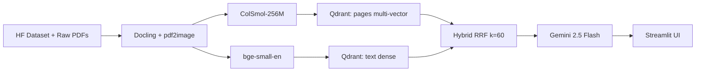

# Video Demo Script - Multi-Modal RAG QA System

Target length: ~4 minutes. Record at 1080p, 30fps. Terminal font 14pt+ for readability.

---

## 0:00 - 0:20 - Problem statement

**Visual:** Full-screen a PDF page from the secondary corpus that contains a dense table or a multi-series bar chart (for example a budget breakdown or a policy-outcomes table).

**Script:**
> "Here is a page from a real policy document. Most of the meaning lives in this table - the numbers, the row and column headers, the way cells are grouped. Text-only RAG loses this. OCR flattens the structure, and chunking scatters the cells across unrelated passages. This project fixes that."

---

## 0:20 - 0:50 - Architecture flyover

**Visual:** Switch to the Mermaid diagram in the Streamlit "About" tab (same diagram as `docs/report.md` and the README).

**Script:**
> "Pages go in two directions. Docling extracts text for BGE-small embeddings. pdf2image rasterises pages for ColSmol-256M - a late-interaction vision encoder that stores one vector per image patch in Qdrant with multi-vector MaxSim. At query time both channels run, reciprocal rank fusion merges them with k equals 60, and the top pages plus text chunks go to Gemini 2.5 Flash for multi-image reasoning. The UI is Streamlit."

---

## 0:50 - 2:30 - Live demo (three queries)

**Visual:** Streamlit app, side panel shows retrieval mode toggle (text_only / vision_only / hybrid) and top-k slider.

### Query 1 (0:50 - 1:20) - Text-dominant, hybrid mode

Type: **"Summarize the main findings of the report."**
Mode: **hybrid**.

**Script:**
> "First query is text-dominant - the kind of prose summarisation where classic RAG does fine. Hybrid mode retrieves three pages, Gemini returns a grounded summary with inline page citations. Notice the citation thumbnails on the right."

### Query 2 (1:20 - 2:00) - Chart-dominant, toggle modes

Pick a chart/table question from `data/corpus_primary/qa.jsonl` whose gold page is a figure (for example a query about a specific chart value).

Run first in **text_only** mode - show that the retrieved page is wrong or that Gemini hedges.
Run again in **vision_only** mode - show the correct chart page is retrieved and Gemini reads the value off the figure.

**Script:**
> "Second query targets a number embedded in a chart. In text-only mode the retriever misses - the chart page has almost no extractable text. Switch to vision-only: ColSmol lands on the correct page because the patch embeddings capture layout and visual structure. Gemini then reads the number straight off the bar chart."

### Query 3 (2:00 - 2:30) - Multi-page, show both citations

Pick a question from `qa.jsonl` whose answer spans two pages (or construct one from the corpus).

**Script:**
> "Third query needs evidence from two non-adjacent pages. Hybrid retrieval returns both, and the citation panel shows both thumbnails side by side. This is where the hybrid channel really earns its keep - each individual channel only had one of the two pages in its top-5."

---

## 2:30 - 3:30 - Evaluation results

**Visual:** Open `data/eval/report.md` (rendered), scroll to the Hit@k comparison chart.

**Script:**
> "Here is the quantitative story. Retrieval evaluated on 100 gold-labelled QA pairs from the ViDoRe synthetic government-reports split. Text-only and vision-only each win on different query types - vision dominates on chart and table queries, text edges ahead on lexical look-ups. Hybrid RRF tracks the better of the two almost everywhere and recovers cases where neither channel alone has the gold page in the top-5. The Hit@5 delta between vision-only and hybrid is the headline number for this project."

Call out specifically: vision_only vs hybrid delta on Hit@5 and MRR.

---

## 3:30 - 4:00 - Limitations and next steps

**Visual:** Back to the Streamlit app, then the report's Limitations section.

**Script:**
> "Limitations: English only, scale tested at about 1000 pages, dependence on the Gemini API, and a 4 GB VRAM ceiling that forced ColSmol over stronger ColVision variants. Next steps: a local VLM drop-in for offline use, a cross-document re-ranker for multi-page reasoning, and domain fine-tuning of ColSmol on policy and financial pages. That is the system. Thanks for watching."

---

## Pre-recording checklist

- [ ] Qdrant container is running: `docker compose ps` shows `qdrant` healthy.
- [ ] Indices are built: both `pages` (multi-vector) and `text` collections exist and report non-zero point counts.
- [ ] `.env` has a valid `GEMINI_API_KEY` and a smoke query succeeds.
- [ ] Cache is warm for all three demo queries - run each one once before hitting record so the video is not bottlenecked by cold Gemini latency or the 7-second free-tier sleep.
- [ ] Streamlit app is launched on a predictable port (`make app`) and the "About" tab with the Mermaid diagram renders correctly.
- [ ] `data/eval/report.md` has been populated by a fresh `make eval` run.
- [ ] Microphone level checked, no background noise, camera framing stable.
- [ ] Screen recording at 1080p minimum, cursor highlighting enabled, terminal font >= 14pt.
- [ ] Close unrelated windows and notifications; browser has only the app tab and the eval report tab open.
