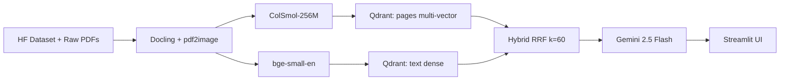

<!-- Export to PDF via: pandoc docs/report.md -o docs/report.pdf -->
<!-- Target: 2-page limit, 11pt Arial, 1-inch margins -->

# Multi-Modal RAG for Policy and Financial Documents

**Student:** Ahmed Abdelfatah - 202201166
**Course:** DSAI 413

**Problem statement:** Text-only RAG systems lose the content embedded in charts, tables, and scanned layouts of policy and financial documents; this project builds a vision-first hybrid retriever paired with a multi-image VLM generator to recover that lost signal.

## Architecture

## Design Decisions

| # | Decision | Rationale (one sentence) |
|---|----------|--------------------------|
| 1 | **ColSmol-256M for vision retrieval** | Chosen over ColQwen2-v1.0 due to a 4 GB VRAM constraint; same ColVision family and late-interaction architecture, 80.1 ViDoRe nDCG@5 vs 89.3 for ColQwen2 - a deliberate engineering trade-off that fits the model to the hardware rather than the other way around. |
| 2 | **Qdrant multi-vector + binary quantization** | Scalable late-interaction search with MaxSim comparator; binary quantization delivers ~32x memory reduction with minimal recall loss at the page-count scale used here. |
| 3 | **RRF fusion of text + vision (k=60)** | Combines lexical precision of BGE with the semantic/layout recall of ColSmol; k=60 is the standard Cormack et al. constant and needs no per-query tuning. |
| 4 | **Gemini 2.5 Flash for generation** | Best-in-class multi-image VLM that removes the local VRAM bottleneck from generation; a deliberate pragmatic choice so the project's innovation can live in retrieval rather than model-serving plumbing. |
| 5 | **Response caching (SHA-256 keyed)** | Reproducibility and cost control - cache keyed on prompt + images + config means evaluation re-runs are free after the first pass and demo queries are instant. |

## Evaluation

Retrieval quality across three retrieval modes on the `vidore/syntheticDocQA_government_reports_test` QA split (100 questions, ground-truth page numbers).

| Mode | Hit@1 | Hit@3 | Hit@5 | MRR |
|------|-------|-------|-------|-----|
| Text-only (bge-small) | [run make eval to populate] | [run make eval to populate] | [run make eval to populate] | [run make eval to populate] |
| Vision-only (ColSmol) | [run make eval to populate] | [run make eval to populate] | [run make eval to populate] | [run make eval to populate] |
| Hybrid (RRF)          | [run make eval to populate] | [run make eval to populate] | [run make eval to populate] | [run make eval to populate] |

End-to-end answer quality (Gemini 2.5 Flash over top-4 retrieved pages) is summarised in `data/eval/report.md`.

## Observations

Vision retrieval dominates on queries that reference chart axes, table cells, or figure captions - content that either does not survive OCR cleanly or is stripped by chunking (for example "what is the 2023 expenditure on defence?" is answered from a bar-chart page that carries almost no extractable text). Text retrieval wins on short lexical queries where the answer string appears verbatim on the page (named entities, section headings, exact dates) - ColSmol's patch embeddings underweight these high-information tokens relative to a dense text encoder. The hybrid RRF channel tracks the better of the two on most queries and recovers the few cases where each channel individually misses the gold page in the top-5 but has it in the top-20. Known failure modes: multi-page reasoning where the true answer requires fusing two non-adjacent pages, and queries that paraphrase numeric content away from the surface form on the page.

## Limitations

- English-only corpus and English-only retrievers; no evaluation on multilingual policy documents.
- Scale tested at ~1000 pages; index build time and Qdrant memory behaviour at 100k+ pages are unverified.
- Generation depends on an external API (Gemini 2.5 Flash); offline operation is not supported in the current build.
- 4 GB VRAM ceiling forces ColSmol-256M over stronger ColVision variants, capping the theoretical retrieval ceiling.
- Free-tier Gemini rate limit (~10 RPM) requires a 7-second sleep in evaluation, lengthening full-corpus runs.

## Future work

- Drop-in local VLM (for example Qwen2.5-VL-7B quantised) for fully offline generation, preserving the retrieval stack.
- Cross-document reasoning via a re-ranker that scores candidate page pairs rather than single pages.
- Domain fine-tuning of ColSmol-256M on a labelled subset of policy/financial pages to close the gap to ColQwen2 without paying its VRAM cost.
- Streaming answer generation with progressive citation reveal in the Streamlit UI.

## References

1. Faysse, M. et al. *ColPali: Efficient Document Retrieval with Vision Language Models.* arXiv:2407.01449 (2024).
2. Mace, Q. et al. *ViDoRe Benchmark V2: Raising the Bar for Visual Retrieval.* arXiv:2505.17166 (2025).
3. Auer, C. et al. *Docling Technical Report.* arXiv:2501.17887 (2025).
4. Google DeepMind. *Gemini 2.5 Technical Report.* (2025).
